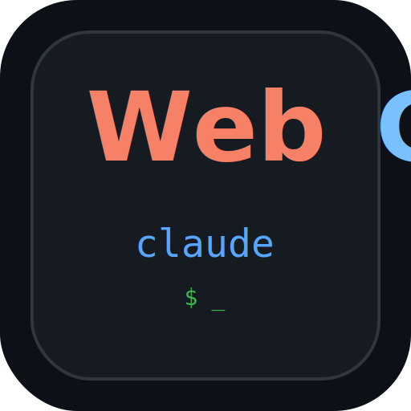

<p align="center">
  
</p>

<h1 align="center">MultiCC</h1>

<p align="center">
  <strong>Self-hosted control plane for AI coding agents. <br>Run Claude Code & Codex from browser, phone, or IM — all at once.</strong>
</p>

<p align="center">
  <a href="#what-is-multicc">What</a> &bull;
  <a href="#vs-the-ecosystem">vs. Ecosystem</a> &bull;
  <a href="#quick-start">Quick Start</a> &bull;
  <a href="#features">Features</a> &bull;
  <a href="#architecture">Architecture</a> &bull;
  <a href="#configuration">Config</a> &bull;
  <a href="#api-reference">API</a> &bull;
  <a href="#faq">FAQ</a>
</p>

<p align="center">
  =20.19" />
  
  
  
  <a href="https://github.com/lsjwzh/MultiCC/stargazers"></a>
</p>

---

## What is MultiCC?

**MultiCC** is a self-hosted orchestration layer that turns your locally-installed AI coding CLIs (Claude Code, OpenAI Codex) into a multi-client, multi-session platform. Start a task on your laptop, monitor it from your phone, and get notified on IM when it finishes — all against the same persistent sessions.

It was built around four observations:

1. **Agent sessions should outlive the client.** Close your laptop mid-task; pick it up from your phone. MultiCC keeps terminal sessions in `tmux` and chat sessions as stateful turns — disconnects never kill progress.
2. **One interface can't serve every moment.** Full terminal when you're at the desk, chat bubbles on the go, push notifications when you're away. MultiCC ships all three against one backend.
3. **Multiple agents work better than one.** Run Claude and Codex sessions side-by-side in the same repo, each isolated in its own git worktree. Dispatch tasks across sessions, merge results back.
4. **Voice is the fastest input on a phone.** Dictate in Chinese or English, let Whisper transcribe and an LLM polish it into a precise prompt. The system learns your project's jargon over time. New: talk to your agents like a phone call with real-time speech-to-speech.

```
        ┌──────────────┐   ┌──────────────┐   ┌──────────────┐   ┌──────────────┐
        │ Desktop Web  │   │  Mobile PWA  │   │ Flutter App  │   │ WeChat / IM  │
        │ (Terminal)   │   │   (Chat)     │   │ Android/iOS  │   │   Bridges    │
        └──────┬───────┘   └──────┬───────┘   └──────┬───────┘   └──────┬───────┘
               │                  │                  │                  │
               ▼                  ▼                  ▼                  ▼
        ┌──────────────────────────────────────────────────────────────────────┐
        │                  MultiCC Server (Express + ws + HTTPS)               │
        │   ┌────────────────────────┐         ┌────────────────────────┐     │
        │   │  tmux session backend  │         │   CLI spawner          │     │
        │   │  (terminal mode)       │         │   (chat mode)          │     │
        │   └──────────┬─────────────┘         └──────────┬─────────────┘     │
        │              ▼                                   ▼                   │
        │     claude / codex CLI               claude stream-json / codex exec│
        └──────────────────────────────────────────────────────────────────────┘
```

---

## vs. the ecosystem

The open-source ecosystem around Claude Code and Codex has grown fast. Below is a survey of projects that **harness** these CLIs (spawn, manage, and route the official binaries) rather than replace them.

> **Standalone coding agents** like [OpenCode](https://github.com/naklecha/opencode), [Aider](https://github.com/paul-gauthier/aider), and [Cline](https://github.com/cline/cline) implement their own agent loop — they're alternatives to Claude Code, not orchestration layers on top. They're excluded from this comparison.

### The CLI harness landscape

| Project | Stars | Architecture | Drives | What it solves |
|---------|-------|-------------|--------|----------------|
| **[cc-switch](https://github.com/farion1231/cc-switch)** | ~111k | Desktop GUI (Tauri) | Claude Code, Codex, OpenCode, Gemini CLI | **Provider & account management.** Switch API keys/providers globally, manage skills across CLIs. The "control panel" for which API backs your CLI. |
| **[Ruflo](https://github.com/ruvnet/ruflo)** | ~62k | CLI + MCP server (TypeScript) | Claude Code, Codex | **Agent meta-harness.** 100+ specialized agents, coordinated swarms, self-learning memory, federation across machines. The "framework" for building agent systems. |
| **[CLIProxyAPI](https://github.com/router-for-me/CLIProxyAPI)** | ~38k | API proxy (Go) | Claude Code, Codex, Gemini, Grok | **API routing.** Wraps multiple CLIs behind a single OpenAI-compatible API endpoint. The "router" layer. |
| **[oh-my-claudecode](https://github.com/Yeachan-Heo/oh-my-claudecode)** | ~37k | CLI (TypeScript) | Claude Code | **Teams-first orchestration.** Multi-agent parallel execution with a teams metaphor. Claude Code only. |
| **[AionUi](https://github.com/iOfficeAI/AionUi)** | ~29k | Desktop + Web (TypeScript) | Claude Code, Codex, OpenCode, Gemini CLI | **Cowork desktop app.** Multi-agent chat UI, 24/7 automation, skills customization. The "desktop workspace" for AI agents. |
| **[vibe-kanban](https://github.com/BloopAI/vibe-kanban)** | ~27k | Web UI (Rust) | Claude Code, Codex, 10+ agents | **Kanban task management.** Plan on a board, each task gets a workspace + agent. *Sunsetting.* |
| **[cc-connect](https://github.com/chenhg5/cc-connect)** | ~13k | Bridge (Go) | Claude Code, Codex, Gemini CLI | **IM bridge only.** Routes agent I/O to Feishu/DingTalk/Slack/Telegram/Discord/WeChat Work. No orchestration. |
| **[CloudCLI](https://github.com/siteboon/claudecodeui)** | ~12k | Web + Mobile (TypeScript) | Claude Code, Codex, Cursor CLI, Gemini | **Web/mobile UI.** Chat interface, file explorer, shell terminal for multiple CLIs. |
| **[Superset](https://github.com/superset-sh/superset)** | ~12k | Desktop (Electron) | Claude Code, Codex, any CLI | **Code editor for agents.** Parallel worktrees, diff viewer, IDE integration. The "IDE" layer. |
| **[Orca](https://github.com/stablyai/orca)** | ~10k | Desktop + Mobile (TypeScript) | Claude Code, Codex, OpenCode | **Agent IDE.** Parallel worktrees, SSH remote, mobile companion, GitHub/Linear integration. YC-backed. |
| **[cockpit-tools](https://github.com/jlcodes99/cockpit-tools)** | ~12k | Desktop (Rust) | Codex, Cursor, Copilot, etc. | **Account manager.** Multi-account switching, quota monitoring, instance management. |
| **MultiCC** | — | **Self-hosted server** (Node.js) | **Claude Code, Codex** | **Persistent multi-agent service.** Web + mobile + IM, scheduling, notifications, voice, cross-session dispatch. |

### What problem does each project solve?

```
"I want to switch API providers / manage accounts"    → cc-switch, cockpit-tools
"I want to build multi-agent swarms with memory"      → Ruflo
"I want a desktop workspace for AI agents"             → AionUi
"I want a Kanban board for coding agents"              → vibe-kanban
"I want an IDE that runs agents in parallel"           → Superset, Orca
"I want a web/mobile UI for my CLI agents"             → CloudCLI
"I want to bridge my agents to IM"                     → cc-connect
"I want to route multiple CLIs through one API"        → CLIProxyAPI

"I want a self-hosted server that turns my AI coding
 agents into a persistent, multi-client, scheduled,
 notifiable, voice-enabled, IM-connected service"      → MultiCC
```

### Head-to-head: orchestration harnesses that drive both Claude Code + Codex

Only projects that explicitly support **both** Claude Code and Codex are included. Capabilities marked as of July 2026 based on public READMEs.

| Capability | cc-switch | Ruflo | AionUi | Superset | Orca | CloudCLI | **MultiCC** |
|------------|:---:|:---:|:---:|:---:|:---:|:---:|:---:|
| **Architecture** | Desktop GUI | CLI + MCP | Desktop + Web | Desktop IDE | Desktop + Mobile | Web + Mobile | **Self-hosted server** |
| **Drives Claude Code** | ✅ | ✅ | ✅ | ✅ | ✅ | ✅ | ✅ |
| **Drives Codex** | ✅ | ✅ | ✅ | ✅ | ✅ | ✅ | ✅ |
| **Per-session provider isolation** | ❌ (global) | ✅ | ❌ | ❌ | ❌ | ❌ | ✅ |
| **Git worktree per session** | ❌ | ✅ | ❌ | ✅ | ✅ | ❌ | ✅ |
| **Merge/sync back to base branch** | N/A | ❌ | N/A | ✅ | ✅ | N/A | ✅ (API + UI) |
| **Syntax-gated merges** | N/A | ❌ | N/A | ❌ | ❌ | N/A | ✅ |
| **Terminal mode (xterm.js)** | ❌ | ❌ | ✅ | ✅ | ✅ | ✅ | ✅ |
| **Chat mode (streaming bubbles)** | ❌ | ✅ | ✅ | ❌ | ❌ | ✅ | ✅ |
| **Multi-client per session** | N/A | ❌ | ❌ | ❌ | ❌ | ✅ | ✅ (web + app concurrent) |
| **Mobile app (native)** | ❌ | ❌ | ❌ | ❌ | ✅ (iOS + Android) | ✅ (responsive web) | ✅ (Flutter) |
| **Push notifications** | ❌ | ❌ | ❌ | ❌ | ✅ (mobile) | ❌ | ✅ (5 channels) |
| **IM bridges** | ❌ | ❌ | ❌ | ❌ | ❌ | ❌ | ✅ (WeChat, Feishu, TG, Discord, Slack) |
| **Cron / scheduled tasks** | ❌ | ✅ (daemon) | ✅ (24/7) | ❌ | ❌ | ❌ | ✅ |
| **Wait/poll auto-resume** | ❌ | ❌ | ❌ | ❌ | ❌ | ❌ | ✅ |
| **run-detached (background)** | ❌ | ✅ (daemon) | ✅ | ❌ | ❌ | ❌ | ✅ |
| **Cross-session dispatch** | ❌ | ✅ (swarm) | ❌ | ❌ | ❌ | ❌ | ✅ |
| **Session sharing (snapshot link)** | ❌ | ❌ | ❌ | ❌ | ❌ | ❌ | ✅ |
| **S2S real-time voice** | ❌ | ❌ | ❌ | ❌ | ❌ | ❌ | ✅ |
| **Voice input (STT + AI refine)** | ❌ | ❌ | ❌ | ❌ | ❌ | ❌ | ✅ |
| **Token usage tracking** | ❌ | ❌ | ❌ | ❌ | ❌ | ❌ | ✅ |
| **Public tunnel (Tailscale/DDNS)** | N/A | ❌ | ❌ | N/A | ❌ | ❌ | ✅ |
| **Self-update mechanism** | ✅ (app update) | ✅ (npx) | ✅ (app update) | ✅ (app update) | ✅ (app update) | ❌ | ✅ (`./multicc update` + APK) |
| **Zero frontend build step** | ❌ (Tauri) | ✅ | ❌ | ❌ (Electron) | ❌ | ❌ | ✅ |
| **Runs headless on a server** | ❌ | ✅ | ❌ | ❌ | ❌ | ✅ (cloud) | ✅ |

### Where MultiCC is unique

MultiCC is the only project in this list that is a **self-hosted server** rather than a desktop app or CLI tool. This architectural choice unlocks its differentiators:

1. **Always-on, headless operation.** Runs on your Mac mini / Linux box / VPS. No desktop needed. Agents keep working after you close your laptop.
2. **Multi-client per session.** Web, Flutter app, and IM bridges can all attach to the same session simultaneously — output fans out to all.
3. **IM-native.** Five IM bridges (WeChat, Feishu, Telegram, Discord, Slack) with bidirectional relay and `<<dispatch>>` confirmation. cc-connect does bridging only; MultiCC does bridging + orchestration.
4. **Scheduled & autonomous work.** Cron jobs with persistent context, wait/poll auto-resume, run-detached background tasks — agents continue without human nudges.
5. **Voice.** S2S real-time voice (VAD → ASR → LLM → TTS → barge-in) and classic STT with vocabulary learning. No other harness offers voice.
6. **Per-session provider isolation.** One session on Claude Max, another on DeepSeek, no env bleed. Other tools switch globally or don't manage providers.

### Where MultiCC is weaker

- **No desktop IDE integration.** Superset and Orca offer diff viewers, inline editing, and IDE handoff. MultiCC's terminal is xterm.js in a browser — no native editor integration.
- **No SSH remote worktrees.** Orca supports running agents on a remote beefy machine via SSH. MultiCC runs everything on the server host.
- **No native GUI app.** cc-switch and AionUi are polished desktop apps. MultiCC is a web server (by design, but some users prefer a native app).
- **Smaller community.** The projects above have 10k–111k stars. MultiCC is newer and less known.
- **No swarm framework.** Ruflo offers 100+ specialized agents, self-learning memory, and federation. MultiCC's cross-session dispatch is simpler and more manual.

---

## Features

### Two modes, one backend

| Mode | UI | Backend |
|------|----|---------|
| **Terminal** (`/`) | Full `xterm.js` — scrollback, colors, input, resize | `tmux` session, `pipe-pane` + named FIFO for reliable output |
| **Chat** (`/chat`) | Message bubbles with streaming tool cards, image previews | Claude Code `stream-json` or Codex `exec --json` — events normalized over WebSocket |

Both modes share the same session registry, auth, and notifications. Reconnect replays the last 500 stream events so you never see a half-empty conversation.

### Multi-provider support

Each session picks its own CLI (`claude` or `codex`) and an optional provider — one session can use the official Claude subscription while another routes through DeepSeek via a custom endpoint.

| CLI | Terminal mode | Chat mode | Provider isolation |
|-----|---------------|-----------|--------------------|
| **Claude Code** | `claude` inside `tmux`, resumed by session id | `claude -p --output-format stream-json` | Per-session `ANTHROPIC_*` env vars; clean default login for sessions without a provider override |
| **Codex** | `codex` / `codex resume <id>` inside `tmux` | `codex exec --json` | Per-provider `CODEX_HOME` under `~/.multicc/codex-homes`; local proxy for non-OpenAI endpoints |

- Providers are managed from `/manage` or the provider API — create, edit, import from `cc-switch`, set per-CLI defaults.
- **Per-session model selection**: each session can override the provider's default model; the chat UI shows a model picker with provider-specific options.
- **Provider-aware model options**: custom providers expose their own model lists (e.g., DeepSeek, GLM, Qwen) via `modelOptions`.

### Session orchestration

- **Git worktree isolation.** Each normal session runs in `<repo>/.multicc-worktrees/<sessionId>` on branch `multicc/<sessionId>`. Parallel agents edit safely; merge/sync APIs move changes between session branches and the base branch.
- **Agent Commander.** Every new directory is seeded with an Agent Commander chat session — a fleet conductor that can coordinate specialized sibling sessions. Comes with role presets for common agent profiles.
- **Cross-session dispatch.** Any chat session can emit `<<dispatch target="SESSION_ID">...</dispatch>>`; MultiCC runs the task on the target session and injects the result back. IM bridges use the same mechanism with explicit confirmation.
- **Passive inter-agent notes.** Sessions leave notes for siblings in the same directory; notes are prepended to the target agent's next chat turn.
- **Syntax-gated merges.** Merge is rejected if a session's changes introduce JS syntax errors — broken code can't reach the base branch.
- **Auto-commit + auto-sync.** Sessions auto-commit before merging; sibling worktrees auto-sync after a merge so everyone stays current.

### Long-running & scheduled work

- **Wait/poll.** Agents register poll or callback waits; MultiCC injects results back into the chat session when the condition resolves — no human nudge needed.
- **`run-detached`.** Long builds, tests, deploys run with `setsid` outside the session lifecycle. Completion auto-registers a wait and sends exit code + output tail back.
- **Cron jobs.** Recurring tasks with standard 5-field cron expressions, each owning a persistent chat session so context carries across runs.
- **Per-session auto-triggers.** Post-turn, file-change, and schedule triggers wake sessions automatically, with cooldowns and manual test firing.
- **Progress-friendly defaults.** The system prompt steers agents toward `run-detached` or explicit waits instead of fragile background shell jobs.

### Speech-to-Speech (S2S) real-time voice

Talk to your agents like a phone call — the newest voice mode:

- **Real-time VAD** (Voice Activity Detection) with RMS-based adaptive noise floor — speaks when you speak, listens when you listen.
- **Streaming ASR** sends audio chunks as you talk; recognition fires automatically on silence.
- **LLM confirmation** refines the recognized text into a structured task list; you confirm with a tap or "yes."
- **Streaming TTS** reads the agent's reply aloud as it arrives; supports Edge TTS (free), OpenAI TTS, and 火山引擎 TTS.
- **Barge-in interrupt**: start speaking and the agent stops talking — ~60ms response.
- **Progress summaries**: the agent gives spoken status updates during long tasks.

Powered by: `public/s2s-session.js` (state machine), `public/vad-monitor.js` (VAD), `public/voice-output.js` (TTS player), `src/tts-service.js` (server-side TTS).

### Voice input (classic mode)

- **Whisper STT** through any OpenAI-compatible endpoint (Groq, OpenRouter, self-hosted).
- **AI refinement** streams raw text through an LLM and replaces filler with precise technical language — delivered over SSE.
- **Vocabulary learning loop.** Accepted corrections feed into `whisper_vocab.json` and are sent as the Whisper `prompt` parameter — the system gets better at your project's jargon over time.

### Multi-client per session

- Multiple browser tabs, phones, and the Flutter app can attach to the same session and see output in sync.
- **Reconnect replay**: a rolling buffer of 500 stream events backfills chat bubbles on reconnect — never see a half-empty conversation after waking the screen.
- **Persistent chat history**: every message is stored in `chat_history/<sessionId>.json` with token counts and timing.

### Token usage & cost tracking

- **Per-provider stats**: daily, weekly, monthly, and all-time token counts for every provider (Claude, Codex, custom endpoints).
- **Per-session breakdown**: each chat message shows input/output tokens and provider attribution.
- **Global usage panel**: `/manage` shows cumulative token usage across all sessions, including Codex session tokens from `~/.codex/sessions`.
- **Live display**: the chat header bar shows per-provider token consumption in real time.

### Notifications

Five delivery channels, triggered when the agent finishes or needs input — and only when you're not actively watching:

| Channel | Reach | Use case |
|---------|-------|----------|
| **Web Push (VAPID)** | Any browser / PWA | Laptop in another room, phone in your pocket |
| **Bark** | iOS `Bark` app | Reliable iOS push without Apple certs |
| **Webhook** | Any HTTP endpoint | Pipe into Slack, Lark, n8n, Home Assistant |
| **In-app voice alert** | Browser `speechSynthesis` | "Task completed" speaks aloud at your desk |
| **Flutter local notification** | Android notification tray | Lock-screen alerts when the app is backgrounded |

### Multi-IM bridges

MultiCC can be your agents' gateway to the world — reply from WeChat, Feishu, Telegram, Discord, or Slack:

| Bridge | Transport | Gateway session | Setup |
|--------|-----------|-----------------|-------|
| **WeChat** (iLink) | PC WeChat API | `__gateway__` | iLink WeChat plugin |
| **Feishu / Lark** | Open Platform long-connection | `__feishu_gateway__` | App ID + Secret in `/manage` |
| **Telegram** | Bot API long-polling | `__telegram_gateway__` | Bot token from @BotFather |
| **Discord** | Gateway WebSocket | `__discord_gateway__` | Bot token + intents |
| **Slack** | Socket Mode | `__slack_gateway__` | App token + bot token |

All bridges support:
- Bidirectional relay between IM and a MultiCC chat session.
- `<<dispatch>>` with explicit confirmation — the agent proposes a task, you confirm in-chat, and the result flows back.
- Live SSE log stream in the browser UI.
- Start/stop controls and credential management from `/manage`.

### Flutter native app

A real Flutter app (Android + iOS), not a wrapped webview:

- **Multi-session sidebar** with swipe-to-close, unread badges, and per-session working directory.
- **xterm terminal widget** and a custom chat UI with message bubbles, tool cards, and inline images.
- **Background notifications** via `flutter_local_notifications` + the server's push pipeline.
- **In-app APK auto-update**: checks the server's `/multicc.apk` mtime, offers one-tap install.
- **Voice capture** with waveform visualization.
- **Task progress scroller** on the home screen showing real-time session status.
- **KPI dashboard**: active sessions, waiting sessions, cron jobs — all tappable for drill-down.
- **Directory management**: drag-to-reorder, compact preview cards, detail sheets.

### Web dashboard (`/manage`)

A single operational surface for everything:

- **Directory workspace view**: session counts, git push status, merge state, real-time activity indicators.
- **Session cards** with status (idle/completed/thinking/editing/running/waiting/error), cwd, provider, client count, last activity, and rainbow border animation when active.
- **Task progress scroller**: live scrolling feed of what each session is doing — shown on the home page.
- **Inline terminal**: click a session card to open its terminal in a large modal — no new tabs needed.
- **Session creation wizard**: multi-step flow (name → role preset → provider → model → create) with provider-aware model options.
- **Git worktree management**: view ahead/behind/conflict state, sync from base, merge to base, push base branch — all one-click.
- **Provider management**: import from `cc-switch`, create/edit/delete local providers, set CLI defaults, switch per-session.
- **Cron job panel**: create, edit, disable, manually run, and delete recurring tasks.
- **Wait/detached task inspector**: see what's pending and what's running in the background.
- **Public tunnel toggle**: enable Tailscale Funnel or monitor 花生壳 DDNS for external access.
- **QR code**: LAN IP + access token for instant phone onboarding.
- **APK download**: latest Flutter build served directly from the dashboard.
- **Onboarding tour**: mask-based guided walkthrough for new users.

### Session sharing

- Share selected chat messages as a **read-only snapshot link** — perfect for showing results to teammates.
- Optional password protection and operation permission.
- Shared sessions render with the same message bubbles and tool cards as the original.

### i18n (Internationalization)

- Both web UI and Flutter app support **Chinese (zh)** and **English (en)**.
- Language is auto-detected from the browser or app locale; toggle available in settings.
- All UI strings, status labels, error messages, and notifications are translated.

### Public access (tunnel)

- **Tailscale Funnel**: one-click toggle in `/manage` to expose your MultiCC server to the public internet via Tailscale.
- **花生壳 (phtunnel) monitor**: optional shell watchdog that restarts the DDNS client if the public URL goes unreachable.
- Both tunnel modes are managed from the dashboard with live status indicators.

### Security

- Optional `ACCESS_TOKEN` gates every API/WebSocket endpoint.
- `multicc_auth` HTTP-only cookie for sticky browser sessions.
- Localhost connections bypass the token.
- Self-signed HTTPS cert auto-generated with SAN entries for every local IP; auto-renewed when your IP changes (required for microphone + PWA).

### Server resilience

- **Port auto-selection**: if the configured port is occupied, MultiCC picks the next available one and logs it.
- **Graceful shutdown**: drains in-flight chat turns on SIGTERM/SIGINT instead of dropping them.
- **Crash recovery**: TTS service handles missing binaries gracefully; VAPID keys auto-generate on first run.
- **Syntax-gated merges**: JS files are validated before merging into the base branch.

---

## Quick Start

### One-Command Install

```bash
curl -sSL https://raw.githubusercontent.com/lsjwzh/MultiCC/main/install.sh | bash
```

Detects your OS, checks prerequisites, clones the repo, installs dependencies, configures an access token, and optionally installs as a background service (macOS `launchd`).

**Install with options:**

```bash
curl -sSL https://raw.githubusercontent.com/lsjwzh/MultiCC/main/install.sh | bash -s -- \
  --port 8080 --token mysecrettoken --no-service
```

| Flag | Description |
|------|-------------|
| `--dir <path>` | Install directory (default: `./MultiCC`) |
| `--token <xxx>` | Pre-set `ACCESS_TOKEN` (default: auto-generated) |
| `--port <port>` | Server port (default: `3000`) |
| `--no-service` | Skip background service install |
| `--no-clone` | Use current directory; skip git clone |
| `--branch <name>` | Git branch to clone (default: `main`) |

**After install:**

```bash
cd MultiCC && ./multicc start     # start the server
cd MultiCC && ./multicc install   # install as macOS launchd background service
```

**Update anytime:** `./multicc update` — pulls latest code, reinstalls deps if `package.json` changed, and restarts.

### Prerequisites

- **Node.js** >= 20.19 (required by `chokidar` 5 ESM — backported `require(ESM)` support landed in Node 20.19 / 22.12)
- **tmux** (for terminal mode; chat mode works without it)
- **Claude Code CLI** — `claude` on your `PATH`, already logged in
- **OpenAI Codex CLI** — `codex` on your `PATH` (optional; only needed for Codex sessions)
- **Flutter** >= 3.8 (optional; only if building the native app yourself)

### Manual Install

```bash
git clone https://github.com/lsjwzh/MultiCC.git
cd MultiCC
npm install
node server.js
```

Open `http://localhost:3000/chat` to begin. Other devices on the same LAN: `http://<your-lan-ip>:3000?token=<ACCESS_TOKEN>` (find the token in `.env`).

### CLI Service Manager

```bash
./multicc start       # start server (auto-picks next port if 3000 is taken)
./multicc stop        # stop server
./multicc restart     # restart server
./multicc status      # check if running
./multicc log         # tail live logs
./multicc update      # pull latest, reinstall deps, restart
./multicc install     # install launchd agent (macOS auto-start on login)
./multicc uninstall   # remove launchd agent
```

**Linux systemd user service:**

```bash
mkdir -p ~/.config/systemd/user
cat > ~/.config/systemd/user/multicc.service <<'UNIT'
[Unit]
Description=MultiCC Server
After=network.target
[Service]
ExecStart=$(which node) $PWD/server.js
WorkingDirectory=$PWD
Restart=always
RestartSec=5
[Install]
WantedBy=default.target
UNIT
systemctl --user daemon-reload
systemctl --user enable --now multicc
```

### Build the Flutter App

```bash
cd app
flutter pub get
flutter build apk --release              # Android
flutter build ios --release --no-codesign # iOS (needs Xcode + signing)
```

The release APK is available in `app/build/app/outputs/flutter-apk/app-release.apk` and served by the dashboard at `/multicc.apk`.

---

## Configuration

All settings are environment variables in `.env`. Voice and TTS settings hot-reload when edited via the dashboard UI. Provider configuration is managed through `/manage` or the provider API.

### Server

| Variable | Default | Description |
|----------|---------|-------------|
| `PORT` | `3000` | Listen port; auto-selects next available if occupied |
| `ACCESS_TOKEN` | *(auto-generated)* | Gates all endpoints; localhost bypassed |
| `CLAUDE_CMD` | *(auto-detected)* | Override path to `claude` binary |
| `CLAUDE_ARGS` | *(none)* | Extra args passed to every `claude` spawn |
| `CLAUDE_CHAT_DISALLOWED_TOOLS` | `AskUserQuestion` | Comma-separated tools disabled in chat mode |
| `CODEX_CMD` | *(auto-detected)* | Override path to `codex` binary |
| `CODEX_ARGS` | *(none)* | Extra args passed to every `codex` spawn |

### Providers

Provider config is stored locally and managed from `/manage`:

| File | Purpose |
|------|---------|
| `providers.json` | MultiCC-owned provider store (API keys inside). Import from `~/.cc-switch/cc-switch.db`, but edits don't write back. |
| `provider-defaults.json` | Default provider id per CLI for new sessions. |
| `~/.multicc/codex-homes/<providerId>/` | Materialized `CODEX_HOME` per Codex provider — isolated auth/config. |

### Voice — Speech-to-Speech (S2S)

| Variable | Default | Description |
|----------|---------|-------------|
| `S2S_CONFIRM_MODEL` | *(uses OPENROUTER_MODEL)* | LLM for requirement confirmation & progress summarization |
| `TTS_PROVIDER` | `edge` | TTS backend: `edge`, `openai`, or `volcano` |
| `EDGE_TTS_VOICE` | `zh-CN-XiaoxiaoNeural` | Edge TTS voice name |
| `OPENAI_TTS_API_KEY` | *(falls back to OPENROUTER_API_KEY)* | OpenAI TTS API key |
| `ASR_PROVIDER` | `openai` | ASR backend for real-time streaming |

### Voice — Classic (STT + Refinement)

| Variable | Default | Description |
|----------|---------|-------------|
| `OPENROUTER_API_KEY` | *(none)* | API key for refinement LLM |
| `OPENROUTER_MODEL` | `google/gemini-2.0-flash-001` | Model for voice refinement |
| `OPENROUTER_BASE_URL` | `https://openrouter.ai/api/v1` | OpenAI-compatible base URL |
| `WHISPER_API_KEY` | *(falls back to `OPENROUTER_API_KEY`)* | Whisper API key |
| `WHISPER_BASE_URL` | `https://openrouter.ai/api/v1` | e.g. `https://api.groq.com/openai/v1` |
| `WHISPER_MODEL` | `whisper-large-v3-turbo` | STT model |
| `WHISPER_LANGUAGE` | `zh` | ISO 639-1 language hint |
| `WHISPER_PROMPT` | *(none)* | Static vocabulary hints (auto-learned terms merge in) |

### Notifications

| Variable | Default | Description |
|----------|---------|-------------|
| `VAPID_PUBLIC_KEY` / `VAPID_PRIVATE_KEY` | *(auto-generated)* | Web Push keys — written to `.env` on first run |
| `BARK_URL` | *(none)* | Bark push endpoint: `https://api.day.app/<your-key>` |
| `WEBHOOK_URL` | *(none)* | Generic webhook — receives JSON `{ title, body, type, sessionId, url }` |

---

## Architecture

```
multicc/
├── server.js                     # Main server — Express, ws, tmux, CLI spawner, voice, push, bridges
├── cron-tasks.js                 # Recurring scheduled chat tasks
├── install.sh                    # One-command installer with OS detection
├── multicc                       # CLI service manager (start/stop/update/install)
├── ecosystem.config.js           # PM2 config (alternative process manager)
│
├── src/                          # Server-side modules
│   ├── providers.js              # Provider store, import, per-session routing
│   ├── chat-stream.js            # Claude stream-json / Codex exec --json event normalizer
│   ├── codex-proxy.js            # Codex provider proxy (responses ↔ chat/completions)
│   ├── codex-proxy-transform.js  # Response format transformers
│   ├── tts-service.js            # Edge/OpenAI/Volcano TTS with WebSocket streaming
│   ├── voice.js                  # Classic voice: STT + LLM refinement + vocabulary
│   ├── voice-asr.js              # Whisper STT integration
│   ├── git.js                    # Git worktree, merge/sync, auto-commit, syntax validation
│   ├── git-queue.js              # Serialized git operations (prevents concurrent conflicts)
│   ├── tmux.js                   # Tmux session management, pipe-pane, FIFO output
│   ├── directories.js            # Directory workspace registry & path helpers
│   ├── wait-injector.js          # Wait/poll registration, resolution, auto-injection
│   ├── detached.js               # run-detached task lifecycle (setsid, polling, completion)
│   ├── push.js                   # VAPID, Bark, webhook notification delivery
│   ├── share.js                  # Session sharing (snapshot links, password auth)
│   ├── bus.js                    # Internal event bus
│   ├── services.js               # Service registry
│   ├── state.js                  # Shared in-memory Maps for session/chat/directory state
│   ├── artifacts.js              # File artifact management
│   ├── token-global.js           # Global token usage aggregation & stats
│   ├── tunnel.js                 # Tailscale Funnel & 花生壳 DDNS monitor
│   ├── skills.js                 # Claude/Codex skill discovery
│   ├── skill-converter.js        # Skill format conversion (Codex ↔ Claude)
│   └── git-push.js               # Git remote push with auth
│
├── bridges/                       # IM gateway bridges
│   ├── wechat-ilink.js           # WeChat bridge (iLink API — current default)
│   ├── wechat-bridge.js          # WeChat bridge (legacy MCP variant)
│   ├── feishu-bridge.js          # Feishu/Lark long-connection bridge
│   ├── telegram-bridge.js        # Telegram bot bridge
│   ├── discord-bridge.js         # Discord bot bridge
│   └── slack-bridge.js           # Slack Socket Mode bridge
│
├── public/                       # Zero-build static frontend
│   ├── index.html / client.js    # Terminal mode UI (xterm.js)
│   ├── chat.html / chat.js       # Chat mode UI (message bubbles, tool cards, inline images)
│   ├── manage.html / manage.js   # Multi-session dashboard & admin panel
│   ├── wechat.html / wechat.js   # WeChat bridge UI
│   ├── events.html               # Directory event timeline viewer
│   ├── share.html                # Shared session snapshot viewer
│   ├── memo.html                 # Directory memo editor
│   ├── s2s-session.js            # Speech-to-Speech state machine
│   ├── vad-monitor.js            # Voice Activity Detection (RMS-based)
│   ├── voice-output.js           # TTS playback via Web Audio API
│   ├── voice-stream.js           # Streaming ASR client
│   ├── voice-worklet.js          # Audio processing worklet
│   ├── pwa.js / sw.js            # PWA registration + push + service worker
│   ├── tour.js                   # Mask-based onboarding guided tour
│   ├── i18n.js                   # Chinese/English internationalization
│   ├── manifest.json             # Web App Manifest
│   ├── agent-presets.json        # Agent role templates (Commander, Reviewer, Builder…)
│   ├── qrcode.min.js             # QR code generation
│   └── multicc.apk               # Latest Flutter APK (build output, gitignored)
│
├── app/                          # Flutter native client (Android + iOS)
│   ├── lib/
│   │   ├── main.dart
│   │   ├── providers/            # ChatProvider, SessionProvider
│   │   ├── screens/              # Setup, Chat, SessionList, Dashboard
│   │   ├── services/             # Chat, Settings, Notification, Update
│   │   └── widgets/              # InputBar (voice + file), MessageBubble, ToolCard
│   ├── android/                  # package com.multicc.multicc_app
│   └── ios/                      # bundle com.multicc.multiccApp
│
├── skills/                       # 76+ Claude/Codex skill definitions
│   ├── autonomous-ai-agents-*    # Agent orchestration skills
│   ├── creative-*                # Design, diagram, art, music skills
│   ├── apple-*                   # Apple ecosystem skills
│   └── ...
│
├── docs/                         # Design & planning docs
│   ├── realtime-voice-design.md
│   ├── realtime-voice-implementation.md
│   ├── codex-proxy-contract.md
│   └── MULTI_PLATFORM_BRIDGE_PLAN.md
│
├── sessions.json                 # Session registry (gitignored)
├── directories.json              # Directory workspace registry (gitignored)
├── providers.json                # Provider store with API keys (gitignored)
├── provider-defaults.json        # Default provider per CLI (gitignored)
├── scheduled_tasks.json          # Cron job definitions (gitignored)
├── chat_history/                 # Per-session chat transcripts (gitignored)
├── events/                       # Per-directory event logs (gitignored)
├── logs/                         # Server logs (gitignored)
├── voice_examples.json           # STT correction history (50-entry FIFO)
├── whisper_vocab.json            # Auto-learned vocabulary (100-term LRU)
├── token_usage.json              # Per-session token stats (gitignored)
├── token_daily.json              # Daily token stats windows (gitignored)
├── push_subscriptions.json       # Web Push subscription store
├── cert.pem / key.pem            # Auto-generated self-signed TLS cert
└── .env                          # Environment + secrets + VAPID keys (gitignored)
```

### How a message flows

**Terminal mode:**

```
browser keystroke → ws → tmux send-keys → claude → tmux pipe-pane → FIFO → ws → xterm render
```

**Chat mode:**

```
user message
  → ws → server.js (CLI + provider abstraction)
  → claude stream-json or codex exec --json [resume/session id]
  → stdout JSON events normalized through src/chat-stream.js
  → buffered (last 500 events) for reconnect replay
  → fan-out to all attached clients (web + Flutter)
  → chat bubble render with live tool cards, inline images, token stats
```

**S2S voice mode:**

```
microphone → VAD (vad-monitor.js) → streaming ASR → LLM confirmation →
user "yes" → agent runs task → streaming TTS reads reply aloud →
user interrupts by speaking → agent stops → next turn
```

### Key design decisions

- **tmux for terminal, raw spawn for chat.** Terminal needs persistent TTY state that survives disconnects. Chat is turn-based — the server spawns the CLI per turn, relying on Claude `--resume` or Codex `exec resume` for continuity.
- **Provider isolation per child process.** Claude providers inject `ANTHROPIC_*` env vars only for that session's spawn. Codex providers materialize separate `CODEX_HOME` directories. The server strips any leaked env vars at startup.
- **Worktree-first concurrency.** Each session owns a branch + worktree. Merge/sync APIs move changes between session branches and the base branch — no shared mutable checkout.
- **No database.** All state is in-memory `Map` objects persisted to flat JSON files. Fast, debuggable, no migration headaches.
- **Single auth layer.** `ACCESS_TOKEN` → HTTP-only `multicc_auth` cookie → applied uniformly to REST, WebSocket, and static files (JS/CSS exempted for login-page rendering).
- **Reconnect-safe chat.** Every WebSocket connect replays buffered events before going live, so the client deterministically rebuilds its bubble state.
- **Reliable continuation.** `wait`, `run-detached`, cron, and dispatch all re-enter a chat session through the same managed turn path — long-running work never gets lost between turns.
- **Syntax-gated merges.** Merge into the base branch is rejected if any `.js` file has syntax errors — broken code can't corrupt the shared branch.
- **Serialized git operations.** Concurrent git commands from multiple polled endpoints are queued through `src/git-queue.js` to prevent race conditions.

---

## API Reference

### Directories

| Method | Endpoint | Description |
|--------|----------|-------------|
| `GET` | `/api/directories` | List directories with session counts and git push status |
| `POST` | `/api/directories` | Register a workspace directory and seed its Agent Commander session |
| `PATCH` | `/api/directories/:id` | Rename / relocate / update role prompt |
| `DELETE` | `/api/directories/:id?force=1` | Delete a directory record, optionally removing owned sessions |
| `POST` | `/api/directories/:id/push` | Push the directory base branch to remote |
| `GET` | `/api/directories/:id/sessions` | List sessions in a directory with worktree and merge state |
| `POST` | `/api/directories/:id/sessions` | Create a Claude/Codex terminal or chat session (`{ cli, kind, label?, model?, provider?, role? }`) |
| `GET` | `/api/directories/:id/workspace` | Live workspace board snapshot |
| `GET` / `PUT` | `/api/directories/:id/memo` | Read / write `<directory>/multicc.memo.md` |
| `POST` | `/api/directories/:id/memo/send` | Send memo text to a chat session |
| `GET` | `/api/directories/:id/events` | Directory event log (merges, dispatches, notes, provider changes) |
| `POST` | `/api/directories/:id/reorder` | Reorder directory cards on the dashboard |

### Sessions

| Method | Endpoint | Description |
|--------|----------|-------------|
| `GET` | `/api/sessions` | List all sessions |
| `GET` | `/api/sessions/:id` | Get session details |
| `PATCH` | `/api/sessions/:id` | Update label, model, role prompt, memory, streaming, auto-continue, provider |
| `DELETE` | `/api/sessions/:id` | Kill and delete a session |
| `POST` | `/api/sessions/:id/relocate` | Change session's working directory |
| `POST` | `/api/sessions/:id/restart` | Restart a dead terminal session in place |
| `GET` | `/api/sessions/:id/merge-status` | Inspect worktree ahead/behind/conflict state |
| `POST` | `/api/sessions/:id/sync` | Merge the directory base branch into this session's worktree |
| `POST` | `/api/sessions/:id/merge` | Merge this session branch back into the directory base branch |
| `POST` | `/api/sessions/:id/notes` | Leave a passive note for another agent in the same directory |
| `GET` | `/api/agent-resources/skills` | List installed Claude and Codex skills |
| `GET` | `/api/agent-resources/claude-sessions` | List Claude Code history sessions |
| `DELETE` | `/api/agent-resources/claude-sessions/:project/:id` | Delete one unlinked Claude history session |
| `DELETE` | `/api/agent-resources/claude-sessions?olderThanDays=N` | Delete unlinked Claude history older than N days |

### Providers

| Method | Endpoint | Description |
|--------|----------|-------------|
| `GET` | `/api/providers?appType=claude\|codex` | List providers with secrets masked, plus defaults |
| `POST` | `/api/providers/import` | Import / refresh providers from `cc-switch` |
| `POST` | `/api/providers` | Create a local provider (`{ appType, name, baseUrl?, authToken?, model?, modelOptions?, settingsConfig? }`) |
| `PATCH` | `/api/providers/:appType/:id` | Update provider metadata or settings |
| `DELETE` | `/api/providers/:appType/:id` | Delete a local provider and clear matching defaults |
| `GET` / `PUT` | `/api/provider-defaults` | Read / set default provider per CLI |

### Orchestration

| Method | Endpoint | Description |
|--------|----------|-------------|
| `POST` | `/api/sessions/:id/wait` | Register a poll or callback wait that injects results into the chat session |
| `POST` | `/api/wait/:wid/resolve?token=<token>` | Resolve a callback wait from an external system |
| `GET` | `/api/sessions/:id/waits` | List waits for one session |
| `DELETE` | `/api/wait/:wid` | Cancel a wait |
| `POST` | `/api/sessions/:id/run-detached` | Launch a server-owned background command and auto-register completion polling |
| `GET` | `/api/sessions/:id/detached` | List detached tasks known to the server |
| `GET` | `/api/detached/:taskId` | Inspect one detached task status and log tail |
| `GET` | `/api/sessions/:id/triggers` | List post-turn, file-change, and schedule triggers |
| `POST` | `/api/sessions/:id/triggers` | Add a trigger (`{ type, prompt?, cooldownMs?, paths?, cron? }`) |
| `PUT` | `/api/sessions/:id/triggers/:tid` | Update one trigger |
| `DELETE` | `/api/sessions/:id/triggers/:tid` | Delete one trigger |
| `POST` | `/api/sessions/:id/triggers/:tid/test` | Fire a trigger immediately for manual testing |

Example wait:
```bash
curl -s "$MULTICC_BASE_URL/api/sessions/$MULTICC_SESSION_ID/wait" \
  -H 'Content-Type: application/json' \
  -d '{"mode":"poll","pollCmd":"test -f build.done && cat build.done","untilContains":"ok","intervalSec":15,"maxChecks":40}'
```

Example detached task:
```bash
curl -s "$MULTICC_BASE_URL/api/sessions/$MULTICC_SESSION_ID/run-detached" \
  -H 'Content-Type: application/json' \
  -d '{"command":"npm test","label":"test suite","intervalSec":10,"maxChecks":120}'
```

### Cron Jobs

| Method | Endpoint | Description |
|--------|----------|-------------|
| `GET` | `/api/cron` | List scheduled tasks with next-run and last-run status |
| `POST` | `/api/cron` | Create a five-field cron task targeting a directory |
| `PATCH` | `/api/cron/:id` | Update schedule, prompt, target directory, CLI, or enabled state |
| `DELETE` | `/api/cron/:id` | Delete a scheduled task |
| `POST` | `/api/cron/:id/run` | Trigger one scheduled task immediately |

Example:
```bash
curl -s "$MULTICC_BASE_URL/api/cron" \
  -H 'Content-Type: application/json' \
  -d '{"name":"Daily review","dirPath":"'"$PWD"'","cli":"claude","cron":"0 9 * * *","prompt":"Review the repo status and summarize risks."}'
```

### Files

| Method | Endpoint | Description |
|--------|----------|-------------|
| `GET` | `/api/files?path=<dir>&session=<id>` | List directory contents |
| `GET` | `/api/download?path=<file>&inline=<bool>` | Download or preview a file |

### Voice — Classic (STT + Refinement)

| Method | Endpoint | Description |
|--------|----------|-------------|
| `POST` | `/api/voice/stt` | Multipart audio upload → Whisper transcription |
| `POST` | `/api/voice/refine` | `{ raw }` → SSE stream of refined text |
| `POST` | `/api/voice/feedback` | `{ raw, refined, userFinal }` → correction log |
| `GET` | `/api/voice/vocab` | Learned vocabulary terms |
| `DELETE` | `/api/voice/vocab/:term` | Remove a term |
| `GET` / `POST` | `/api/settings/voice` | Get / update voice configuration (hot-reload) |
| `GET` / `POST` | `/api/settings/power` | Read / update macOS lid-sleep prevention |

### Voice — Speech-to-Speech (S2S)

| Method | Endpoint | Description |
|--------|----------|-------------|
| `POST` | `/api/voice/confirm` | S2S: parse raw text into structured requirement items for user confirmation |
| `POST` | `/api/voice/progress-summary` | S2S: generate a spoken progress summary from stream events |
| `GET` / `POST` | `/api/settings/tts` | Get / update TTS provider, voice, API keys |

### Push / Notifications

| Method | Endpoint | Description |
|--------|----------|-------------|
| `GET` | `/api/push/vapid-key` | VAPID public key |
| `POST` / `DELETE` | `/api/push/subscribe` | Register / remove push subscription |
| `POST` | `/api/push/test` | Fire a test push to all subscribers |
| `POST` | `/api/bark/test` | Fire a test Bark push |
| `POST` | `/api/webhook/test` | Fire a test webhook |

### Session Sharing

| Method | Endpoint | Description |
|--------|----------|-------------|
| `POST` | `/api/sessions/:id/share` | Create a share link (`{ password?, allowOperate? }`) |
| `GET` | `/api/sessions/:id/shares` | List active shares for a session |
| `DELETE` | `/api/sessions/:id/share/:token` | Revoke a share link |
| `POST` | `/api/sessions/:id/share-messages` | Share selected messages as a snapshot |
| `GET` | `/share/:token` | View a shared session (HTML page) |
| `POST` | `/api/share/:token/auth` | Authenticate a password-protected share |
| `GET` | `/api/share/:token/session` | Get shared session data |

### Token Usage

| Method | Endpoint | Description |
|--------|----------|-------------|
| `GET` | `/api/token-usage` | Global token usage stats across all sessions |
| `GET` | `/api/token-usage?provider=<id>` | Filter token stats by provider |

### Tunnel (Public Access)

| Method | Endpoint | Description |
|--------|----------|-------------|
| `GET` | `/api/tunnel/status` | Tailscale Funnel & 花生壳 status |
| `POST` | `/api/tunnel/toggle` | Enable/disable Tailscale Funnel |

### WeChat Bridge

| Method | Endpoint | Description |
|--------|----------|-------------|
| `GET` | `/api/wechat/status` | Bridge running state |
| `GET` / `POST` | `/api/wechat/config` | Get / update bridge config |
| `POST` | `/api/wechat/start` | Start bridge |
| `POST` | `/api/wechat/stop` | Stop bridge |
| `POST` | `/api/wechat/send` | Send message to WeChat (`{ text, target }`) |
| `GET` | `/api/wechat/log` | Message log (`?since=<ms>`) |
| `GET` | `/api/wechat/events` | SSE stream of live log entries |

### Feishu / Lark Bridge

| Method | Endpoint | Description |
|--------|----------|-------------|
| `GET` | `/api/feishu/status` | Bridge running state |
| `GET` / `POST` | `/api/feishu/config` | Get / update App ID, App Secret, domain |
| `GET` / `PUT` / `DELETE` | `/api/feishu/gateway` | Read / create / destroy the gateway session |
| `POST` | `/api/feishu/gateway/reset` | Clear gateway history and reset |
| `POST` | `/api/feishu/start` | Start the long-connection bridge |
| `POST` | `/api/feishu/stop` | Stop the bridge |
| `POST` | `/api/feishu/send` | Send a message to Feishu/Lark |
| `GET` | `/api/feishu/log` | Message log |
| `GET` | `/api/feishu/events` | SSE stream of live log entries |

### Telegram / Discord / Slack Bridges

All three bridges share the same API structure (substitute the platform name):

| Method | Endpoint | Description |
|--------|----------|-------------|
| `GET` | `/api/<platform>/status` | Bridge running state |
| `GET` / `POST` | `/api/<platform>/config` | Get / update bot token and config |
| `GET` / `PUT` / `DELETE` | `/api/<platform>/gateway` | Read / create / destroy the gateway session |
| `POST` | `/api/<platform>/gateway/reset` | Clear gateway history and reset |
| `POST` | `/api/<platform>/start` | Start the bridge |
| `POST` | `/api/<platform>/stop` | Stop the bridge |
| `POST` | `/api/<platform>/send` | Send a message to the IM platform |
| `GET` | `/api/<platform>/log` | Message log |
| `GET` | `/api/<platform>/events` | SSE stream of live log entries |

### Server Info & Update

| Method | Endpoint | Description |
|--------|----------|-------------|
| `GET` | `/api/server-info` | Server IP, port, protocol, URL, token |
| `GET` | `/multicc.apk` | Latest Flutter APK (served from `public/multicc.apk`) |

### WebSocket Protocol

**Terminal mode:** `ws[s]://host/?id=<sessionId>&token=<token>`

```jsonc
// Client → Server
{ "type": "input",  "data": "ls -la\r" }
{ "type": "resize", "cols": 120, "rows": 40 }
{ "type": "upload", "tempId": "up_xxx", "name": "file.txt", "mime": "text/plain", "data": "<base64>" }

// Server → Client
{ "type": "session_id", "id": "a1b2c3d4" }
{ "type": "output",     "data": "..." }
{ "type": "exit",       "data": "..." }
{ "type": "relocate",   "cwd": "/new/path" }
{ "type": "file_saved", "tempId": "up_xxx", "path": "/tmp/multicc_xxx.txt", "name": "file.txt" }
```

**Chat mode:** `ws[s]://host/chat?id=<sessionId>&token=<token>`

```jsonc
// Client → Server
{ "type": "user_message", "text": "refactor server.js", "files": [...] }
{ "type": "cancel" }          // abort the in-flight turn
{ "type": "clear" }           // wipe history and start a fresh session

// Server → Client
{ "type": "system",       "subtype": "init", "is_streaming": false, "session_id": "..." }
{ "type": "stream_event", "event": { /* Claude stream-json event */ } }
{ "type": "turn_end",     "ok": true, "provider_token_stats": {...} }
{ "type": "error",        "error": "..." }
{ "type": "chat_history", "messages": [...], "tokenUsage": {...} }
{ "type": "provider_token_stats", "windows": { "daily": ..., "weekly": ..., "monthly": ..., "allTime": ... } }
```

---

## FAQ

### "Certificate warning" on first visit

Expected. MultiCC generates a self-signed cert for HTTPS (required for microphone + PWA). Click **Advanced** → **Proceed** once per device.

### Claude command not found

MultiCC searches common install paths on startup. If it still can't find `claude`:

```bash
echo 'CLAUDE_CMD=/path/to/claude' >> .env
```

### Codex command not found

MultiCC searches Homebrew, local-bin, Cargo, and shell PATH. If needed:

```bash
echo 'CODEX_CMD=/path/to/codex' >> .env
```

### Which provider does a session use?

Each session records `cli` (`claude` or `codex`) and an optional `provider` id. If `provider` is empty, the session uses the local default login. If set, only that session's spawned process gets the provider override — siblings can use different providers safely. Check `/manage` → session card for the active provider.

### How do I switch a session's model?

On `/manage`: click the session card → "Model" dropdown shows provider-specific options. On the chat page: the model picker is in the header bar. Switching a session's provider automatically clears the model override so the new provider's default takes effect.

### "此浏览器不支持录音" (Browser doesn't support recording)

`MediaRecorder` requires a secure context. Make sure you're on `https://` (or `http://localhost`) and have accepted the self-signed certificate.

### How do I use S2S (speech-to-speech) real-time voice?

1. Install `edge-tts` (Python): `pip install edge-tts`
2. Install `ffmpeg`: `brew install ffmpeg` (macOS) or `sudo apt install ffmpeg` (Linux)
3. In the chat page, click the phone icon to start a voice session
4. Speak naturally; the system will confirm your request, then the agent runs and reads its reply aloud
5. Interrupt by speaking — the agent stops and listens

### Flutter app can't reach the server from my phone

- Check the phone is on the same LAN.
- Open `https://<your-ip>:3000` in the phone's browser first and accept the cert.
- Confirm `ACCESS_TOKEN` is set in the Flutter setup screen if the server has one.

### How do I access MultiCC from the public internet?

Use the **Tunnel** section in `/manage` → toggle **Tailscale Funnel** (requires Tailscale installed and authenticated). For 花生壳 DDNS users, the tunnel monitor keeps the phtunnel process alive.

### tmux sessions pile up

Terminal-mode sessions are named `multicc-<id>`. To clean up orphans:

```bash
tmux list-sessions | grep multicc | cut -d: -f1 | xargs -I{} tmux kill-session -t {}
```

### Port is already in use

MultiCC auto-selects the next available port if the configured one is occupied. Check the startup log for the actual port in use, or set a different `PORT` in `.env`.

### How do I share a chat conversation?

In the chat page, select messages and click "Share" — you'll get a read-only link. You can optionally set a password and allow viewers to operate. Shares are revoked when you delete the session.

### I upgraded from WebCC — what changed?

The rename changed persistence keys (`webcc_*` → `multicc_*`) and Android/iOS package identifiers (`com.webcc.*` → `com.multicc.*`):

- **Web UI:** you'll get logged out once; notification/voice toggles reset to defaults.
- **Flutter app:** install as a **new app** (old one stays side-by-side until you uninstall it). Setup screen asks for host / token / session again.
- **launchd service:** `./webcc uninstall` first, then `./multicc install` — the `Label` changed from `com.webcc.server` to `com.multicc.server`.
- **tmux sessions** named `webcc-*` are orphaned; kill with the command above (substituting `webcc`).

### How do I add a Telegram / Discord / Slack bridge?

In `/manage` → Bridges section, select the platform, enter your bot token or app credentials, create a gateway session, then start. Each bridge runs its own gateway session and supports the same dispatch + reply flow as WeChat/Feishu.

---

## Tech Stack

| Component | Technology |
|-----------|------------|
| **Server** | Node.js + Express + ws |
| **Terminal backend** | tmux + pipe-pane + named FIFO |
| **Chat backend** | Claude Code `stream-json` / Codex `exec --json`, normalized over WebSocket |
| **S2S voice** | Whisper STT + LLM confirmation + Edge/OpenAI/Volcano TTS + Web Audio API |
| **Provider routing** | MultiCC `providers.json`, optional `cc-switch` import, per-session env / `CODEX_HOME` isolation |
| **Codex proxy** | Responses ↔ chat/completions format transform for non-OpenAI endpoints |
| **Worktree orchestration** | Git worktrees + branches per session, serialized merge/sync APIs, syntax-gated merges |
| **Web frontend** | Vanilla JS, xterm.js 5.3, zero build step |
| **Mobile app** | Flutter 3.8, `xterm`, `web_socket_channel`, `shared_preferences`, `flutter_local_notifications` |
| **Voice STT** | Whisper (Groq / OpenRouter / OpenAI-compatible) |
| **Voice refinement** | OpenRouter LLM over SSE |
| **TTS** | Edge TTS (free) / OpenAI TTS / 火山引擎 TTS |
| **Notifications** | Web Push (VAPID) + Bark + Webhook + SpeechSynthesis + Flutter local notifications |
| **IM bridges** | WeChat (iLink), Feishu/Lark (Open Platform), Telegram (Bot API), Discord (Gateway), Slack (Socket Mode) |
| **Scheduler / waits** | Central cron tasks, per-session auto-triggers, server-owned wait/detached-task injector |
| **Public access** | Tailscale Funnel + 花生壳 DDNS monitor |
| **i18n** | zh/en via `public/i18n.js` + Flutter locale |
| **Token stats** | Per-provider daily/weekly/monthly/all-time aggregation from chat history |
| **TLS** | Auto-generated self-signed certs with SAN IPs, auto-renewed on IP change |
| **Service manager** | macOS `launchd` via `./multicc install`; systemd on Linux |

### Runtime dependencies

```
express                 ^4.18.2        HTTP server and routing
ws                      ^8.16.0        WebSocket server
multer                  ^1.4.5-lts.1   Multipart file uploads
web-push                ^3.6.7         VAPID push notifications
node-pty                ^1.0.0         PTY fallback (terminal recovery)
node-cron               ^4.2.1         Per-session schedule triggers
chokidar                ^5.0.0         File-change triggers
@larksuiteoapi/node-sdk ^1.67.0        Feishu/Lark long-connection bridge
discord.js              ^14.16.0       Discord Gateway bridge
node-telegram-bot-api   ^0.66.0        Telegram Bot bridge
@slack/bolt             ^4.2.0         Slack Socket Mode bridge
```

> **Zero frontend build step.** All web client code is plain JavaScript served as static files. The Flutter app is the only component requiring a build toolchain.

---

## License

MIT. See [LICENSE](LICENSE).

---

<p align="center">
  <sub>Built for Claude Code, Codex, and provider-routed coding agents · <a href="https://github.com/lsjwzh/MultiCC">github.com/lsjwzh/MultiCC</a></sub>
</p>
